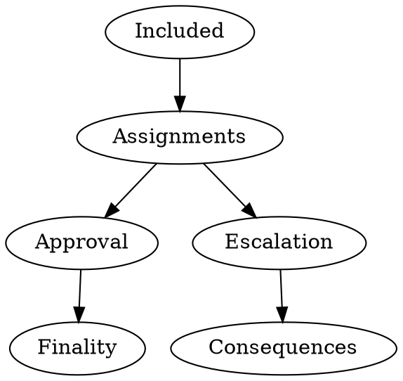

# 审批程序

审批程序是中继链确保只有有效的区块被最终确定的机制，而支持验证者要对设法将坏区块纳入中继链的行为负责。

只要区块没有被中继链的最终性程序 GRANDPA 最终确定，那么让一个平行链区块包含在中继链的分叉中并不是灾难性的。如果该区块没有被最终确定，这意味着中继链的分叉可以通过动态分叉选择规则来恢复，从而使诚实的验证者忽略任何包含该区块的分叉。

处理一个坏的分叉要经过以下几个阶段：

1. 检测
2. 升级
3. 结果

首先，坏块必须被诚实的一方发现。其次，诚实的一方必须将坏块升级到由所有验证者检查。最后，一个坏区块的正确结果必须发生。第一个结果，如上所述，是恢复链，使所有节点认为是最好的，不再包含坏块。第二个结果是砍掉所有恶意验证者。请注意，如果包含坏块的链被还原，那么争议的结果需要被移植，或者至少可以移植到该链的所有其他分叉上，这样恶意验证者在所有可能的历史上都会被砍掉。换句话说，需要没有任何可能的中继链可以让恶意验证者无代价地逃脱。

接受一个 parablock 是通过检测阶段而没有争议的最终结果，或者是通过升级/争议阶段而获得积极的结果。为了使其发挥作用，我们需要检测程序具有这样的特性：总是选择足够多的诚实验证者来检查联锁，并且他们不能被对手干扰。这需要与一般的平行链的规模问题相平衡：获得第一个属性的最简单方法是让每个人都检查所有的东西，但这显然太沉重了。因此，我们对另一个属性也有一个期望的约束，即让尽可能少的验证者检查任何特定的 parablock。我们的赋值函数是我们选择验证人对 parablocks 进行批准检查的方法。

相对于考虑 parablocks 是否被批准而言，把中继链块看作是已经被批准或没有被批准，往往更有意义。含有一个坏块的中继链块需要被撤销，而只含有已批准的块的中继链块可以被称为已批准，只要其父中继链块也被批准。重要的是，任何特定的中继链块的有效性都取决于其祖先的有效性，因此我们不会最终确定一个在其祖先中有坏块的块。

审批大致有两个部分：

- **分配** 决定了哪些验证者对哪些候选人进行批准检查。它确保每个候选人收到足够的随机检查器，同时减少对手获得足够检查器的几率，并限制对手的预知能力。它跟踪批准投票，以识别 "不显示" 批准检查所需的可疑时间，也许表明该节点正在受到攻击，并在这种情况下分配更多的检查。它跟踪中继链的等价交换，以确定对手何时可能获得关于分配的预知，并在这种情况下增加额外的检查。

- **批准检查** 监听分配子系统发出的分配通知，我们应检查特定的候选人。然后，它通过首先调用重建子系统来获得候选人，其次在候选人身上调用候选人有效性子系统来执行这些检查，最后发出批准投票，或者可能启动一个争议。

这两个协议首先作为链外共识协议运行，使用所有验证者之间的 gossip 的 信息，其次作为这个链外协议的事后进度的链上记录。我们需要链上协议来为链下协议提供奖励。

审批需要两种 gossip 消息类型，即由其分配子系统创建的分配通知，以及由我们的审批检查子系统在得到候选人有效性效用子系统授权后发送的审批投票。

## 审批密钥

我们需要为审批子系统提供两个单独的密钥：

- **审批分配密钥** 是仅用于分配标准 VRF 的 sr25519/schnorrkel 密钥。我们通过在 VRF 的额外消息中包括其中继链上下文和额外数据，隐含地用批准分配密钥签署分配通知，但将这些从其 VRF 输入中排除。

- **审批投票密钥** 将只签署候选人的 parablock 有效性，没有自然的密钥类型限制。这没有必要实际体现一个新的会话密钥类型。我们只是想在分配和批准之间做出区分，尽管遥远的未来的节点配置可能有利于单独的角色。我们重新使用与实践中用于 parachain 支持的相同的密钥。

审批投票密钥可以比较容易地由一些加固的签名者工具来处理，也许甚至是 HSM，假设我们为审批投票钥匙选择 ed25519。审批分配键可能支持也可能不支持加固的签名人工具，但这样做听起来要复杂得多。事实上，分配密钥只决定了决定审批检查器分配的 VRF 输出，对于这些输出，他们只能采取行动或不采取行动，所以他们不能含糊其辞、撒谎等，对验证器操作者来说，如果有惩罚的风险，也是很少的。

在未来，我们将确定在几种加固技术中，哪一种对整个网络最有利。我们可以为验证者提供一个多进程多机器的架构，也许甚至让人想起 GNUNet，或者更像智能 HSM 工具。我们可能反而会设计一个更像完整系统的系统，比如像 Cosmos 的哨兵节点。在任何一种情况下，审批分配可能由一个稍微加固的机器处理，但不一定像审批投票那样加固，但批准投票机器必须同样运行外国 WASM 代码，这增加了他们的风险，所以分配听起来是有帮助的。

## 分配

审批分配决定了每个验证者对哪些候选中继链块进行审批检查。一个审批环节只考虑一个中继链块，并且只分配中继链块宣布可用的那些候选人。

分配要兼顾几个方面：

- 限制对手对任务的预知性。
- 确保有足够的检查者，并且
- 相对公平地分配任务。

受托人决定自己的任务，使用两到三个任务标准检查特定的候选人。在相关之前，受托人从不透露他们的分配，流言蜚语延迟了提前发送的分配，这限制了其他人的预知性。受托人只通过中继链块了解他们的分配。

所有标准都要求验证者使用他们的 VRF 秘钥评估一个可验证的随机函数（VRF）。所有的标准都输入关于会话的中继链块的特定数据，称为 "故事"，并输出要检查的候选者和称为 `DelayTranche` 的优先次序。

当然，当他们的候选人变得可用时，我们会解放可用的核心，但有一个批准分配标准继续将每个候选人与它在可用时占据的核心号码联系起来。

分配在由这个`DelayTranche`决定的松散的时间回合中进行，假设半秒的闲话时间，其进行速度大约是六秒块生产的 12 倍。如果在我们到达第`t`轮时，候选人`C`需要更多的批准检查员，那么任何在延迟批次`t`中对`C`有任务的验证者都会说闲话，为`C`发送任务通知。我们继续下去，直到所有候选人都有足够的批准检查员被分配。如果我们还没有足够的核对器，我们就把整个批次的核对器放在一起，所以我们期望严格地超过足够的核对器。如果有些核对人返回他们的批准票的速度太慢，我们也会采取较晚的批次（见下文没有显示）。

分配确保验证者检查那些他们有延迟档零又有最高优先权的中继链块，所以对手总是面对与延迟档零的预期分配数量相等的诚实检查者。

在这些标准中，BABE VRF 输出为两个标准提供了故事，它减少了对手可以定位自己的检查器的频率。我们有一个标准，其故事由候选人的区块哈希值和外部知识组成，即中继链等价物存在一个冲突的候选人。当对手通过在中继链区块生产中的等价交换获得对另外两个人的预知时，它提供了不可预见的分配。

## 公告/通知

我们在节点之间 gossip 分配通知，以便所有验证者知道哪些验证者应该检查每个候选人，以及任何候选人是否需要更多的验证者。

分配通知包括一个由区块哈希值给出的中继链上下文、一个分配标准（由标准标识符和可选的标准特定字段组成）、一个受托人标识符和受托人的 VRF 签名，其本身由一个 VRF 预输出和一个 DLEQ 证明组成。它的 VRF 输入由标准组成，通常包括一个特定的标准字段，以及一个关于其中继链上下文块的 "故事"。

我们从不在包含分配通知的 gossip 消息中包含故事，而是要求每个验证者重建它们。我们在争端过程中从不关心分配，所以这不会使远程争端复杂化。

在 Schnorr VRF 中，有一个与此输入不同的额外的签名信息，我们将其设置为中继链块散列。因此，分配通知是自签名的，并且可以在没有额外签名的情况下 "礼貌地" gossip，也就是说，在能够从中继链上下文计算出故事的节点之间。换句话说，如果我们不能计算出一个分配通知的 VRF 部分所要求的故事，那么我们的自签名属性就会失效，我们就不能验证它的来源。我们可以通过另一个签名层（64 字节）或包括从故事中计算出来的 VRF 输入点（32 字节）来解决这个问题，但这样做似乎没有什么用处。

任何验证者都可以过早地发送他们的分配通知和/或批准投票。我们提前 gossip 批准票，因为它们代表了验证者的一个重要承诺。然而，我们推迟发送分配通知，直到它们与我们的本地时钟一致。我们还规定了一个礼貌性条件，即接收者知道分配通知所使用的中继链上下文。

## 故事

我们根据关于中继链区块`R`的两个可能的 "故事" 来制定分配标准，其中包括候选人又称宣布候选人可用。所有的故事都有一个输出，试图最小化对抗性影响，然后作为分配标准的 VRF 输入。

我们首先有一个`RelayVRFStory`，它从中继链块生产者在创建`R`时产生的另一个 VRF 输出中输出随机性。在诚实的节点中，只有这一个创建`R`的中继链块生产者事先知道这个故事，甚至他们在两个纪元前也一无所知。

在 BABE 中，我们创建这个值时，调用`schnorrkel::vrf::VRFInOut::make_bytes`，上下文为 "A&V RC-VRF"，`VRFInOut`来自授权生产一级区块的 VRF，否则来自二级区块类型的 VRF。

在 Sassafras 中，我们将始终使用非匿名的回收 VRF 输出，而不是授权区块生产的匿名环形 VRF。我们目前不知道 Sassafras 是否会有一个单独的 schnorrkel 密钥，但如果它重复使用其环形 VRF 密钥，有一个等价的`ring_vrf::VRFInOut::make_bytes`。

我们喜欢`RelayVRFStory`允许相对较少的选择，但在中继链区块生产中含糊其辞的对手可能会过早地了解依赖于`RelayVRFStory`的分配，因为同一个中继链 VRF 出现在多个区块中。

因此，我们提供了一个次要的`RelayEquivocationStory`，它输出候选人的区块哈希值，但只针对候选人的等价交换。当存在另一个中继链区块`R1`时，我们说`R`中的候选人`C`是一个等价物，即`R`和`R1`具有相同的`RelayVRFStory`，但`R`包含`C`，`R1`不包含`C`。

我们也想要检查位于我们首选的中继链之外的候选等价物，这代表了分配模块的一个稍微不同的用法，并且可能需要 gossip 消息中的更多信息。

## 分配标准

分配标准使用故事和验证人的密钥批准分配密钥来计算实际分配。分配标准输出一个`Position`，包括要检查的`ParaId`，以及分配生效时的优先级`DelayTranche`。

赋值标准有三种类型：`RelayVRFModulo`、`RelayVRFDelay`和`RelayEquivocation`。其中，`RelayVRFModulo`和`RelayVRFDelay`都运行一个 VRF，其输入是`RelayVRFStory`的输出，而`RelayEquivocation`运行一个 VRF，其输入是`RelayEquivocationStory`的输出。

其中，我们有两个不同的 VRF 输出计算。

`RelayVRFModulo`运行几个不同的样本，其 VRF 输入是`RelayVRFStory`和样本号。它用`schnorrkel::vrf::VRFInOut::make_bytes`计算 VRF 输出，使用 "A&V 核心 "的上下文，将这个数字与可用核心的数量相乘，并输出刚刚被宣布为可用的候选人，并由 aka 离开该可用核心包括。我们放弃任何没有返回候选人的样本，因为在这个中继链块中没有候选人离开采样的可用性核心。我们最初选择三个样本，但我们可以通过增加到四个或五个样本，并相应地减少支持检查来使 polkadot 更加安全和高效。所有成功的`RelayVRFModulo'样本都被分配到延迟档位 0。

`RelayVRFDelay`和`RelayEquivocation`没有采样过程。相反，我们在特定的候选人上运行它们，它们从其 VRF 输出中计算延迟。 `RelayVRFDelay'对包括在中继链块下的所有候选者运行，也就是宣布可用，并通过`RelayVRFStory'输入相关 VRF 输出。 `RelayEquivocation`只对候选区块等值运行，并通过`RelayEquivocation`故事输入其区块散列值。

`RelayVRFDelay`和`RelayEquivocation`都使用`schnorrkel::vrf::VRFInOut::make_bytes`计算它们的输出，使用上下文 "A&V Tranche"，并将结果按`num_delay_tranches + zeroth_delay_tranche_width`的方式减少，并将结果 0 到`zeroth_delay_tranche_width`合并为 0。通过这种方式，他们确保了 zeroth 延迟段的`zeroth_delay_tranche_width+1`倍于任何其他段的分配数。

作为未来的工作（或 TODO？），我们应该使用`vrf_merge`合并具有相同延迟和故事的分配通知。我们不能合并那些具有相同延迟和不同故事的通知，因为`RelayEquivocationStory`可能会改变，但`RelayVRFStory`永远不会改变。

## 播音员和观察者/跟踪者

我们跟踪所有验证人对每个中继链区块相关的候选人宣布的批准分配，这告诉我们哪些验证人被分配给哪些候选人。

我们允许每个验证人在每个故事中最多为每个候选人分配一次任务，因此一个验证人可以在 "RelayVRFDelay"和 "RelayEquivocation"标准下被分配，但不能在 "RelayVRFModulo"和 "RelayVRFDelay"标准下分配，因为它们都使用同一个故事。我们只允许每个审定者对每个候选人投一次批准票，这对任何适用的标准都是有意义的。

我们宣布，并开始检查我们自己的任务，当其批次的延迟达到时，但只有当跟踪器说受让人候选人需要更多的批准检查者。我们从不宣布我们认为不必要的任务，因为早期宣布会给对手带来信息。所有延迟批零的分配总是被宣布，这包括所有`RelayVRFModulo`分配。

换句话说，如果某个候选者`C`在我们到达第`t`轮时需要更多的批准检查者，那么任何在延迟档`t`中对`C`有任务的验证者都会散布他们对`C`的任务通知，并开始重建和验证`C`。然而，如果`C`达到了足够的分配，那么后来有分配的验证者就跳过宣布他们的分配。

我们继续下去，直到所有候选人都有足够的批准检查员被分配。我们从不在批次内对任务进行优先排序，并将某一批次的所有任务或未分配的任务放在一起计算，所以我们经常会超额完成分配的批准检查员的目标数量。

### 不显示

我们有一个 "不显示" 的超时时间，比一个中继链槽长，所以至少 6 秒，在此期间，我们希望批准检查应该成功地重建候选区块，重做其擦除编码以检查候选接收，最后重新检查候选区块本身。

如果验证者在我们收到他们的任务通知后，在这个 "不显示" 的时间内没有批准或提出异议，我们就认为他们是 "不显示"。我们从收到他们的任务通知开始计时，而不是从我们想象中的实际时间开始计时，因为否则的话，收到迟到的任务通知就会立即产生 "不显示 "和不必要的工作。

我们担心 "不显示" 代表验证器受到了拒绝服务攻击，可能是为了防止它重建候选人，但也可能是为了延迟它对争端的 gossip。因此，我们总是通过增加一整批额外的延迟验证器来取代 "不显示"，所以这种攻击总是导致额外的验证器。

举个例子，假设我们需要 20 个验证人，但第 0 档只产生 14 个，第 1 档只产生 4 个，那么我们从第 2 档拿走所有 5 个，因此该候选人需要 23 个验证人。如果第一组或第二组的检查员查理在 8 秒内没有反应，那么我们就从第三组中加入所有 7 名检查员。如果第三组中的一个检查员 Cindy 在 8 秒内没有反应，那么我们就从第四组中抽取全部 3 个检查员。我们现在有 33 个检查员在对候选人进行检查，所以这个过程升级得很快。

我们之所以升级得这么快，是因为我们担心查理和辛迪可能是分配给该候选人的唯一诚实的检查员。因此，如果查理或辛迪最终返回批准，那么我们就可以得出批准的结论，并放弃第四批的检查员。

因此，我们要求 "不显示" 的超时时间要比中继链的时间长，这样我们就可以在链上见证 "不显示"。我们将在下面讨论这如何有助于奖励取代 "不显示" 的验证者。

我们避免对 "不显示" 本身进行削减，尽管 "不显示" 可能会进入一些惩罚重复不良表现的计算，可能会取代`ImOnline'，我们可以减少他们的奖励并进一步奖励那些填写的人。

作为未来的工作，我们可以预见扩大 "不露面 "的方案，使额外的检查者匿名，比如通过使用分配注意到一个新的标准，采用环形 VRF，然后所有验证者通过请求几个擦除编码的碎片来提供掩护，但这样的匿名方案听起来非常复杂，远远超出我们最初的功能。

## 分配推迟

我们希望验证者在随机获得过多的任务时，偶尔会超载。所有这些波动都会在多个区块中得到很好的摊销，但这就会减慢最终结果。

因此，我们允许验证者故意推迟发送他们的任务。如果没有人知道他们的任务，那么他们就会避免产生 "不显示" 的情况，而且工作量会正常进行。

我们强烈希望延期来自于比零更重要的批次，因为零批次的检查在一定程度上提供了更多的安全性。

TODO：什么时候？这对网络来说是最好的吗？

## 链上验证

我们应该在链上验证批准，以奖励批准检查者。因此，我们要求 "不显示" 的超时时间比中继链槽长，这样我们就可以在链上见证 "不显示"，这有助于实现这一目标。链上记录链下过程的主要挑战是对抗性区块生产者，他们可能会审查投票或向链上发布投票，导致其他投票被忽略和不被奖励（奖励偷窃）。

原则上，所有验证者都有一些 "档次"，在这些档次上，他们被分配给准链上的候选人，这确保我们最终达到足够的验证者。如上所述，当缓慢的验证者最终出现时，我们经常收回 "不显示"，所以见证他们最初是 "不显示" 有助于管理奖励。

我们希望链上验证应该分两个阶段进行。我们首先在中继链区块中记录分配通知和批准投票，在区块验证中再次进行 VRF 或常规签名验证，并在中继链状态中插入链上验证的无签名说明，其中包含每个分配通知的验证人、批次、准绳和中继区块高度。然后，我们后来有另一个中继链块，运行一些 "批准的"内在的，它从状态中提取所有这些笔记，并将它们输入我们的批准代码。

我们现在在推迟和链上验证之间的互动中遇到了一个利基关注。任何拥有零档（或其他低档）分配的验证者可以延迟发送分配通知，比如因为他们推迟了他们的分配档（这是允许的）。如果他们后来在决赛时间前后发送了这个分配通知，那么他们就与这个批准的比赛。本质上：如果他们的公告得到链上（也允许），那么是的，它推迟了决赛。如果它没有上链，那么是的，我们有一个公告，链外的共识系统说是有效的，但链上的人因为太慢而忽略了。

在这种情况下，我们需要链上的人获胜，但这样做需要对最终结果施加一个令人厌恶的漫长的总体延迟。我们也可以探索对推迟的限制，但这听起来更难。

## 参数

我们倾向于在 `RelayVRFModulo` 下进行审批检查员的分配，而不是 `RelayVRFDelay`，因为 `RelayVRFModulo` 可以避免给单个检查员太多的分配，而且零档分配最有利于安全。我们建议在`RelayVRFModulo`下至少分配 16 个检查员，尽管分配水平从未被正确分析过。

我们的延迟标准`RelayVRFDelay`和`RelayEquivocation`都有两个主要参数，即每档预期检查器和零延迟档宽度。

我们要求每批的预期检查者少于 3 个，因为否则一个拥有 1/3 利益的对手可以强迫所有节点检查所有的块。我们强烈建议每批的预期检查者少于两个，这有助于避免意外的和故意的爆炸。我们还建议每档的预期检查器大于 1，这有助于防止攻击者预测比推进一档只增加他们自己的验证器。

我们通过零档分配来提高安全性，所以`RelayEquivocation`应该将其前几个档合并到零档。我们将其描述为零延迟段的宽度，最初我们将`RelayEquivocation`设置为 12，`RelayVRFDelay`设置为 1。

## 为什么用 VRFs?

我们用 VRF 做分配，是为了给 "足够多的" 检查者一些意义，而不仅仅是 "预期" 检查者。

我们可以指定一个只使用系统随机性的协议，这很有效，因为我们最强的防御是预期的分配自己的诚实检查员的数量。在这种情况下，对手可以轻而易举地用他们自己的检查员淹没他们自己的区块，所以这个强大的防御成为我们唯一的防御，延迟分批变得毫无用处，所以一些区块实际上有零个批准检查员，可能总体上只有一个检查员。

虽然 VRFs 要求对手在这种攻击之间等待的时间要长得多，这也有助于对付那些没有什么利害关系的对手，因为他们破坏了验证器。VRFs 提高了用户的信心，即没有发生这种 "驱赶"攻击，因为延迟付款系统至少确保了一些最低数量的批准检查者。在这种情况下，VRFs 允许减少支持检查和增加批准检查，这使 polkadot 更有效率。

## Gossip

任何验证人都可能过早地发送他们的任务通知和/或批准票。我们对批准票进行gossip，因为它们代表了验证人的一个重要承诺。我们保留但推迟gossip分配通知，直到它们与我们的本地时钟一致。

过早地 gossip 分配通知可能会产生一个拒绝服务的载体。如果是这样的话，我们可能会利用使我们的时钟同步的相对时间方案，可以想象它允许放弃过早的分配。

## 最终性 GRANDPA 投票规则

中继链要求验证者参与 GRANDPA。在 GRANDPA 中，验证者就他们认为是链上最好的区块提交链外投票，GRANDPA 决定由超级多数的子链所包含的共同区块。根据前几轮投票的结果，对可以提交的内容也有额外的限制。

为了避免最终确定任何没有收到足够的批准票或有争议的东西，我们将把批准协议与对 GRANDPA 投票策略的改变结合起来，使诚实的节点只对其中的每个准链候选人都被批准的链进行投票。此外，该投票规则防止对存在任何现场争议或任何争议已解决的候选人无效的链进行投票。

因此，最终确定的中继链应该只包含大多数人认为其中的每一个区块都得到了充分的批准的中继链区块。

### 未来工作

我们可以考虑额外的 gossip 消息，节点声称 "缓慢的可用性"和/或 "缓慢的候选"，以微调任务的 "不显示" 系统，但足够长的 "不显示" 延迟可能就足够了。

一旦可用性系统使用直接的 UDP 连接工作，我们将在 UDP 方面发展更多的实践经验。在这一点上，我们应该发现重建是否在完整的图中表现得足够好或
从拓扑结构的限制中获益。在这一点上，一个分配通知可以隐含地从一个随机的 1/3 中请求碎片，也许是拓扑结构的限制，这可以节省一个闲话轮。如果这种初步的快速重建失败了，那么节点就直接请求替代的棋子。这与 "慢速可用性"的要求重叠，有一个有趣的设计空间。
